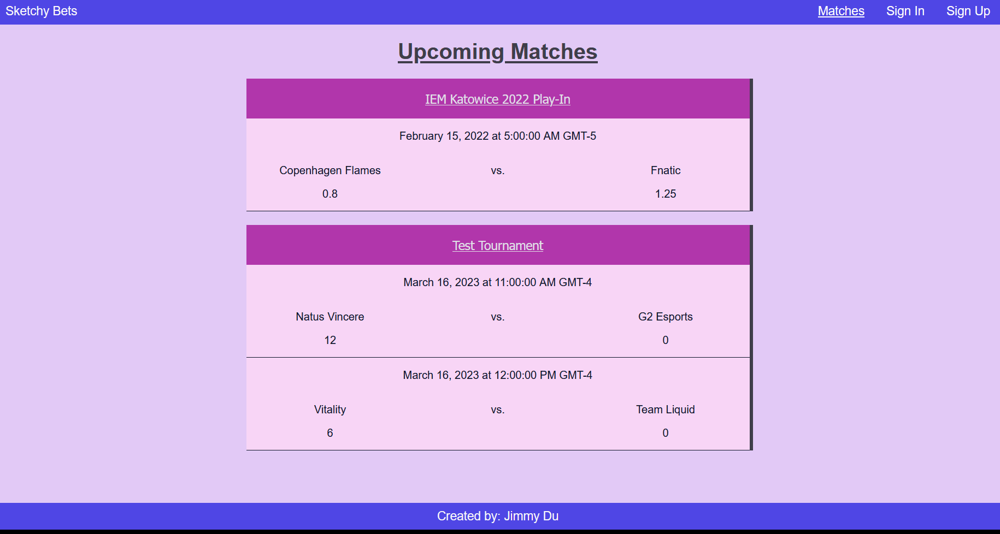
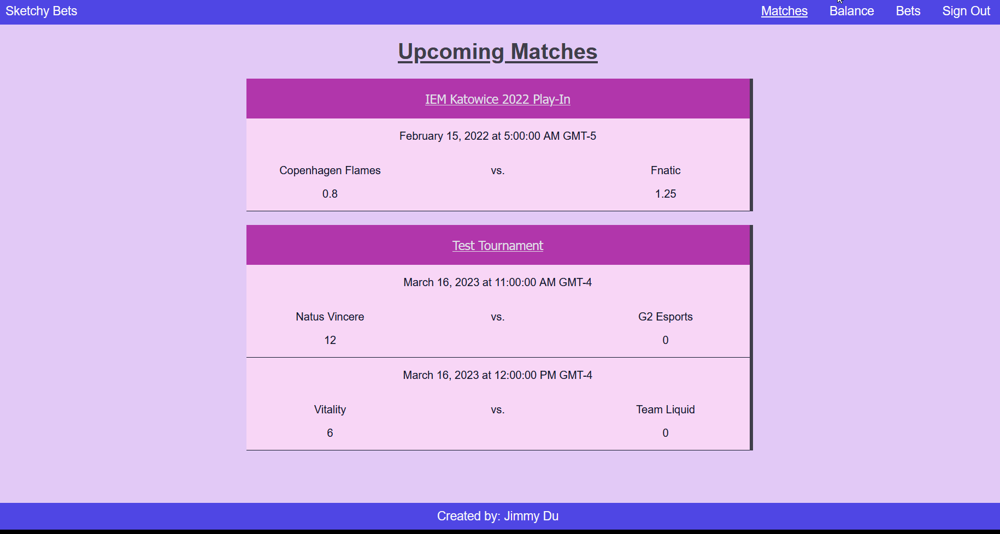
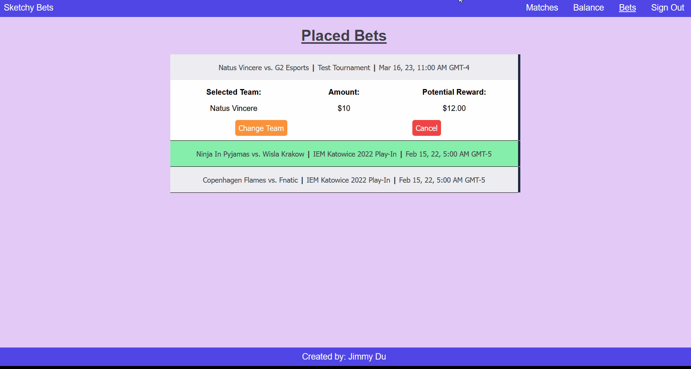
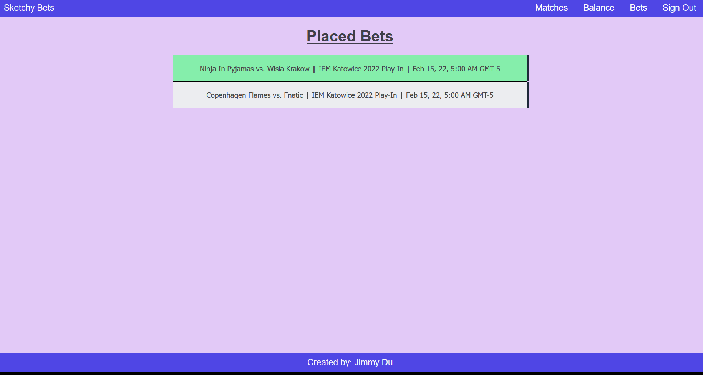

# Sketchy Bets
Sketchy Bets is a web application that enables users to place bets on esport matches. Bet odds of matches are updated as soon as bets are placed by users, providing up to date match info as soon as they change. The website has been designed to fit on various screen sizes so that the experience remains the same when accessing across different devices.

## Live Demo
Unfortunately, the API for the Sketchy Bets website is currently unavaliable. I have provided gifs showcasing the functionality of the website until it is restored.

<b>Sign in</b>:

<b>Deposit and Place Bet</b>:

<b>Change Team and Cancel Bet</b>:

<b>Withdraw and Sign Out</b>:

## Tech
- Angular
- Spring Boot
- Spring Security
- PostgreSQL
- RESTful API
- TypeScript
- Java
